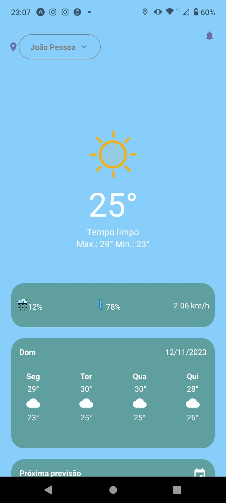

# Climate-App

Sobre:

## Informações

- Título: `Climate-App`
- Autor: `Thiago José Amaral`,
- tecnologias: `React Native + javascript`

##Imagens:

  

  

  

  
  

## Passo a passo para testes
- Importante possuir o expo: (https://docs.expo.dev/get-started/installation/)
- expogo no seu dispositivo móvel(smartphone) recomendado usar 
 no android para evitar erros: (https://expo.dev/client)
1 - Clone o repositório com: `git clone {link https}`.
2 - Após clonar execute: `npm install` para instalar as dependências.
3 - Antes de testar entre no site (https://console.hgbrasil.com/) e crie uma
chave própria e a substitua na variável `apiKey` do arquivo Main.js.
4 - Após possuir todas as dependências e tecnologias ditas acima
rodar o comando `npx expo start` e escanear o qr code através do celular.
Lembre-se de ter o celular conectado na mesma rede de internet do seu computador.

## References

- [Api](https://console.hgbrasil.com/)
- [React-native](https://reactnative.dev/)
- [Expo](https://expo.dev/)

#Autor:
[ Thiago Amaral](https://github.com/Tjaos)
